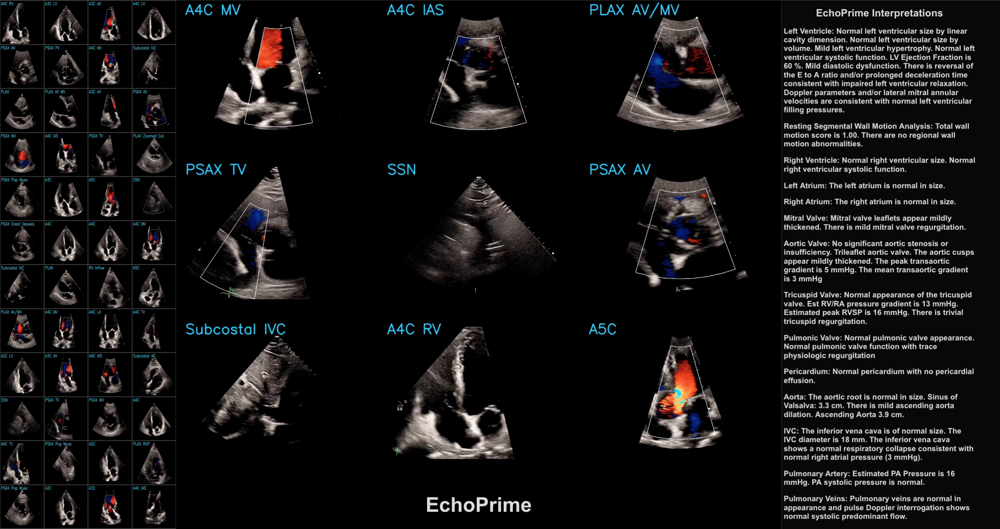

# EchoPrime: A Multi-Video View-Informed Vision-Language Model for Comprehensive Echocardiography Interpretation

This repository contains the official inference code for the following paper:

**EchoPrime: A Multi-Video View-Informed Vision-Language Model for Comprehensive Echocardiography Interpretation**  
*Milos Vukadinovic, Xiu Tang, Neal Yuan, Paul Cheng, Debiao Li, Susan Cheng, Bryan He\*, David Ouyang\**  
[Read the paper on arXiv](https://arxiv.org/abs/2410.09704), 
[See the demo](https://x.com/i/status/1846321746900558097)



## How To Use
1) Clone the repository and navigate to the EchoPrime directory

`git clone https://github.com/echonet/EchoPrime`
2) Download model data 
    * `wget https://github.com/echonet/EchoPrime/releases/download/v1.0.0/model_data.zip`
    * `wget https://github.com/echonet/EchoPrime/releases/download/v1.0.0/candidate_embeddings_p1.pt`
    * `wget https://github.com/echonet/EchoPrime/releases/download/v1.0.0/candidate_embeddings_p2.pt`
    * `unzip model_data.zip`
    *  `mv candidate_embeddings_p1.pt model_data/candidates_data/`
    *  `mv candidate_embeddings_p2.pt model_data/candidates_data/`
3) Install requirements `pip install -r requirements.txt`
4) Test on a sample input. 50 - number of videos, 3 number of channels, 16 - number of frames, 224 - height and width 
```
from echo_prime import EchoPrime
import torch
ep = EchoPrime()
ep.predict_metrics(ep.encode_study(torch.zeros((50, 3, 16, 224, 224))))
```
5) Follow EchoPrimeDemo.ipynb notebook to see how to correctly process the input and inference Echoprime.

## Licence
This project is licensed under the terms of the MIT license.


## FAQ:

### After processing the images they appear green-tinted.
Make sure that you have the correct libraries installed. Use requirements.txt to install the dependencies.


## How to run the code in docker?

```
docker build -t echo-prime .
```

```
docker run -d --name echoprime-container --gpus all echo-prime tail -f /dev/null
```
Then you can attach to this container and run the notebook located at 
`/workspace/EchoPrime/EchoPrimeDemo.ipynb`.
