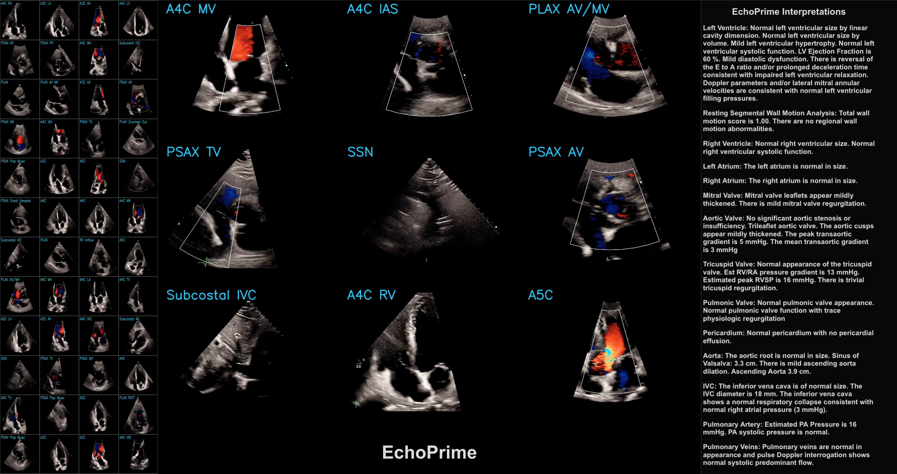

# EchoPrime: A Multi-Video View-Informed Vision-Language Model for Comprehensive Echocardiography Interpretation

This repository contains the official inference code for the following paper:

**EchoPrime: A Multi-Video View-Informed Vision-Language Model for Comprehensive Echocardiography Interpretation**  
*Milos Vukadinovic, Xiu Tang, Neal Yuan, Paul Cheng, Debiao Li, Susan Cheng, Bryan He, David Ouyang*  
[Read the paper on arXiv](https://arxiv.org/abs/2410.09704)

## How To Use
1) Clone the repository
2) Download model data `wget https://github.com/echonet/EchoPrime/releases/download/v1.0.0/model_data.zip`
3) `unzip model_data.zip`
4) Follow EchoPrimeDemo.ipynb notebook

## Licence
This project is licensed under the terms of the MIT license.